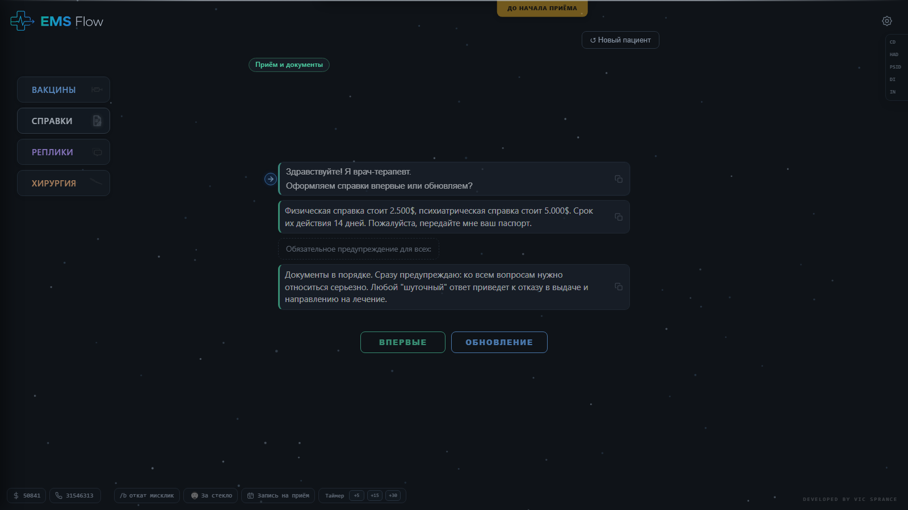
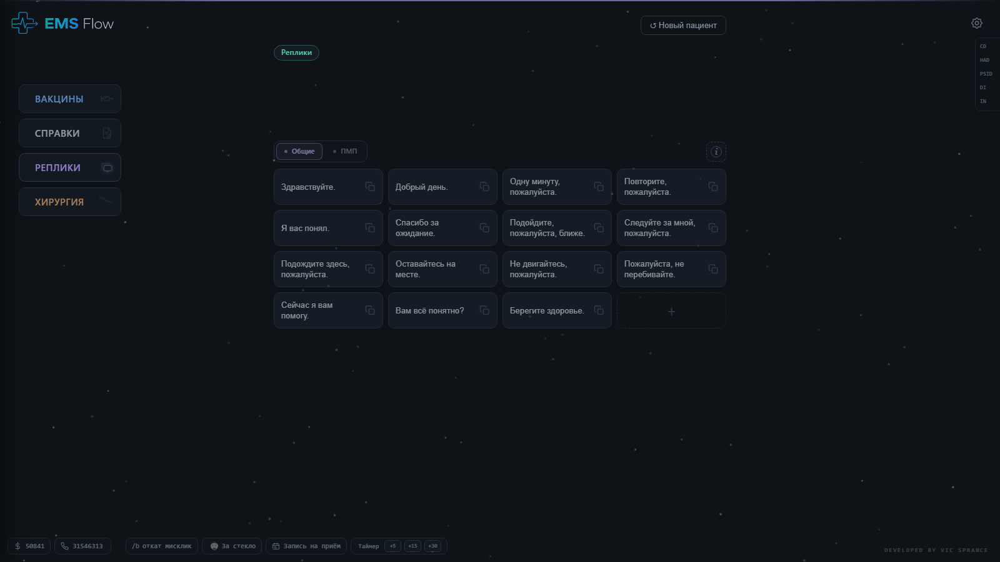
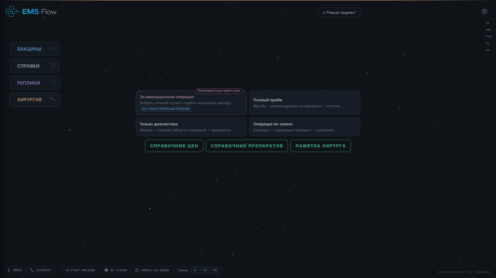

<p align="center">
  
</p>

<h1 align="center">EMS Flow</h1>

<p align="center">
  Ранняя альфа настольного ассистента для сотрудников EMS сервера Seattle в Majestic RP.
</p>

<p align="center">
  <strong>Ранняя альфа · Сборка 0190 · Windows x64 · Только Seattle</strong>
</p>

## Скачать

- [Установщик EMS Flow, сборка 0190](https://github.com/VicDavis/EMS-Flow/releases/download/build-0190-alpha/EMS.Flow.Alpha.Setup.Build.0190.exe)
- [Портативная версия EMS Flow, сборка 0190](https://github.com/VicDavis/EMS-Flow/releases/download/build-0190-alpha/EMS.Flow.Alpha.Portable.Build.0190.zip)
- [Страница релиза и описание изменений](https://github.com/VicDavis/EMS-Flow/releases/tag/build-0190-alpha)

> **Важно:** программа находится на стадии ранней альфы. Она может содержать ошибки, хотя основными функциями уже можно пользоваться. Правила, цены, процедуры и реплики рассчитаны исключительно на сервер Seattle. На других серверах условия могут отличаться.

## Как выглядит приложение



<p align="center">
  
  
</p>

## Что умеет EMS Flow

- помогает проходить маршруты оформления и обновления медицинских справок;
- содержит сценарии вакцинации, хирургии и экзаменационной операции;
- предоставляет наборные реплики для общих ситуаций и ПМП;
- последовательно собирает выбранные части реплик в буфере обмена;
- сохраняет маршрут пациента и позволяет восстановить его после сброса;
- поддерживает настраиваемые горячие клавиши, полноэкранный режим и показ поверх игры;
- содержит быстрый таймер, настройки интерфейса, звуков и производительности.

## Установка

### Установщик

1. Закройте ранее запущенный EMS Flow.
2. Скачайте `EMS.Flow.Alpha.Setup.Build.0190.exe`.
3. Запустите установщик и выберите каталог установки.
4. Новую сборку можно устанавливать поверх предыдущей. Пользовательские настройки сохраняются.

### Портативная версия

1. Скачайте `EMS.Flow.Alpha.Portable.Build.0190.zip`.
2. Распакуйте архив в отдельную папку.
3. Запустите находящийся внутри EXE-файл.

Обе редакции автономны: необходимые компоненты уже включены. Сборка предназначена для Windows x64.

## Предупреждение Windows SmartScreen

Приложение пока не подписано платным сертификатом Authenticode, поэтому Windows может показать предупреждение о неизвестном издателе.

## SHA-256 файлов

Контрольные суммы приведены для пользователей, которым они нужны. Обычная установка не требует дополнительных действий.

```text
6689137502c75da4ee669c5a785db528048f4fec1c26e4478fd3da787d29698e  EMS.Flow.Alpha.Setup.Build.0190.exe
2442f3d04f1f5cf13007d6f979dcf7e0b4885d3529d4208ecd2d705368fb0450  EMS.Flow.Alpha.Portable.Build.0190.zip
```

Контрольные суммы также сохранены в файле [`SHA256SUMS.txt`](SHA256SUMS.txt).

## Какие файлы скачивать

GitHub автоматически показывает в каждом релизе архивы `Source code (zip)` и `Source code (tar.gz)`. Они не являются приложением и не содержат исходный код EMS Flow. Для использования программы скачивайте только установщик или портативную версию по ссылкам выше.

Исходный код приложения не публикуется. В репозитории размещены описание проекта, история разработки и готовые пользовательские сборки.

## История разработки

EMS Flow прошёл путь от небольшой HTML-шпаргалки до самостоятельного Windows-приложения. История восстановлена по сохранённым версиям и показывает не только крупные функции, но и десятки небольших итераций, откатов и интерфейсных доработок.

- [Читаемая история разработки](docs/DEVELOPMENT_HISTORY.md)
- [Подробная история версий v0.58.1-v0.72.2](docs/HISTORY_V058_TO_V072.md)
- [Полный журнал изменений от v0.73.1 до сборки 0190](CHANGELOG.md)

Проект создаётся владельцем без классического опыта программирования. AI-ассистенты используются как инструменты разработки, а постановка задач, продуктовые решения, проверка поведения, направление дизайна, приёмка итераций и организация выпусков остаются последовательной работой автора проекта.

## Настройки и приватность

Настройки EMS Flow хранятся локально в профиле текущего пользователя Windows. Интерфейс приложения не отправляет их на внешние серверы. Внешние страницы открываются только после явного нажатия пользователем на соответствующую ссылку.

## Обратная связь

Сообщить об ошибке, предложить идею или оставить конструктивный отзыв:

[Telegram-сообщество EMS Flow](https://t.me/+qNzY6aaGcqlmMDdi)

Проект продолжит развиваться, если окажется полезным и будет получать содержательную обратную связь от пользователей.

## Поддержать разработчика

[Купить разработчику чашку чая](https://www.donationalerts.com/r/vicstiglitz)

## Автор

Разработчик: **Vixpress**. Другие проекты доступны в [профиле VicDavis](https://github.com/VicDavis).

© 2026 Vixpress. Все права защищены. Распространяется готовая альфа-сборка; разрешение на публикацию, изменение или распространение исходного кода не предоставляется.

