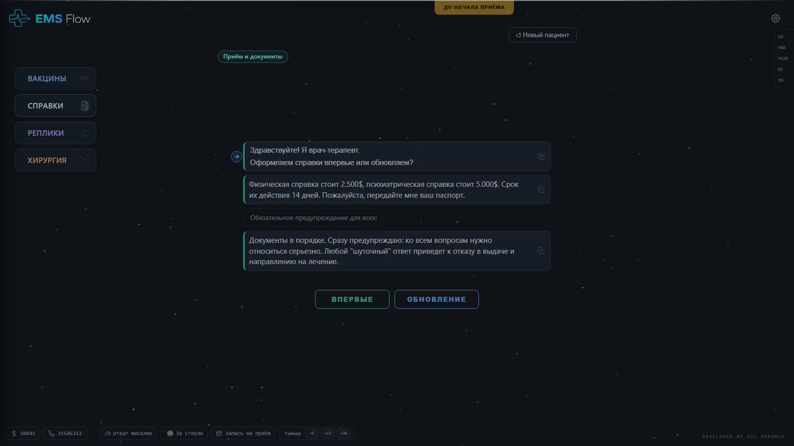
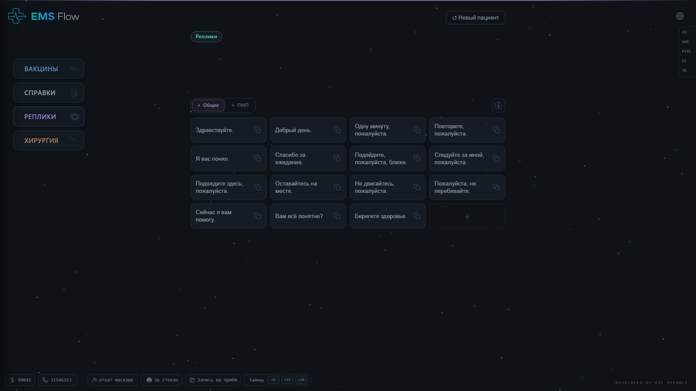
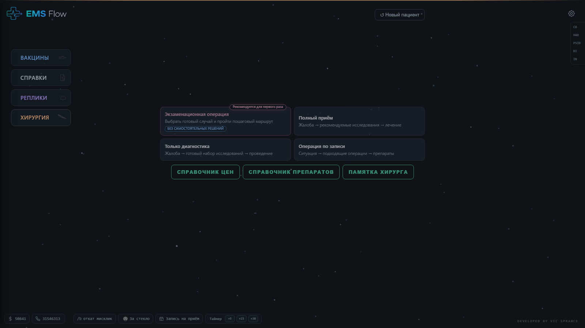

<p align="center">
  
</p>

<h1 align="center">EMS Flow</h1>

<p align="center">Настольный ассистент для сотрудников EMS сервера Seattle в Majestic RP.</p>
<p align="center"><strong>Ранняя альфа · Build 0244 · Windows x64 · Только Seattle</strong></p>

## Скачать

- [Установщик — Build 0244](https://github.com/VicDavis/EMS-Flow/releases/download/alpha-0244/EMS.Flow.Alpha.Setup.Build.0244.exe)
- [Портативная версия — Build 0244](https://github.com/VicDavis/EMS-Flow/releases/download/alpha-0244/EMS.Flow.Alpha.Portable.Build.0244.zip)
- [Релиз 0244: изменения, файлы и ограничения](https://github.com/VicDavis/EMS-Flow/releases/tag/alpha-0244)
- [Все выпуски](https://github.com/VicDavis/EMS-Flow/releases)

> Ранняя альфа: возможны ошибки. Оверлей и автоотправка требуют проверки внутри GTA. В Build 0244 изменён способ ввода текста, но работа на всех системах и приём текста игровым чатом не подтверждены. Правила, цены и реплики рассчитаны на Seattle.

## Что нового после 0240

- Отметка «Мут» в личном реестре и последовательная отправка `/vmute статик` для отмеченных игроков.
- Исправления перетаскивания реплик: проекция полного размера, отмена Escape, перенос между страницами без случайного копирования.
- Новая компоновка оверлея: главное меню справа, компактный хотбар, меню отделов у правого края ниже основного меню, раскрытие при наведении.
- Памятки и подсказки временно скрываются в прозрачном режиме, не изменяя настройки обычного режима.
- Автоотправка использует прямой Unicode-ввод вместо Ctrl+V; добавлены паузы между этапами и корректная отмена.
- Убраны пустые плашки реестра, подпись автора перенесена на страницы без хотбара, обновлена встроенная документация.

[Полное описание изменений 0241–0244](docs/RELEASE_0244.md).

## Возможности

- Пошаговые маршруты вакцинации, справок, хирургии и рекрутинга Department of Internship.
- Готовые реплики, копирование отдельных предложений и сборка фразы из нескольких плиток.
- Собственные страницы реплик: редактирование, размеры плиток и перетаскивание.
- Личный реестр игроков: имя, статик, фракция, заметки, «Друг» / «Враг» и независимая отметка «Мут».
- Пропуска EMS, заявления, жалобы, запись на приём и быстрый таймер.
- Поиск по приложению, настройки интерфейса, звуков, фона и анимаций.
- Прозрачный оверлей, показ поверх игры и экспериментальная автоотправка в игровой чат.

EMS Flow — игровая шпаргалка и помощник по маршрутам, а не источник медицинских рекомендаций для реальной жизни.

## Установка и обновление

### Установщик

1. Закройте EMS Flow.
2. Скачайте `EMS.Flow.Alpha.Setup.Build.0244.exe`.
3. Установите поверх прежней версии в ту же папку приложения.
4. Сохранения удалять не нужно. Перед обновлением можно экспортировать настройки в приложении.

Не устанавливайте приложение в папку с исходным проектом. Выделите для него отдельный каталог.

### Портативная версия

1. Скачайте `EMS.Flow.Alpha.Portable.Build.0244.zip`.
2. Распакуйте и запустите EXE из архива.
3. При обновлении закройте приложение и замените portable-файл новой версией.

Обе редакции содержат необходимые компоненты. Установленная версия поддерживает обновления через GitHub; режим выбирается в настройках. Portable и HTML обновляются вручную.

Сборка не подписана сертификатом Authenticode: Windows SmartScreen может показать предупреждение о неизвестном издателе.

## Управление

| Действие | Управление |
| --- | --- |
| Показать EMS Flow поверх текущего окна / свернуть | Alt+D |
| Включить / выключить прозрачный оверлей | Alt+O |
| Переключить полный экран | F11; вне текстовых полей также F |
| Редактировать плитку реплики | Тройной ПКМ |
| Переместить плитку | Зажать ЛКМ и перетащить |
| Отменить перенос | Escape |
| Удалить текущую пустую страницу реплик | Delete вне редактора |
| Сохранить карточку игрока | Ctrl+Enter |
| Открыть документацию | Нажать логотип EMS Flow |

Alt+D не должен удалять значок с панели задач. В оверлее элементы EMS Flow принимают ЛКМ, свободное пространство предназначено для приложения под ним. Для GTA рекомендуется оконный или безрамочный полноэкранный режим.

## Автоотправка и массовый мут

1. Оставьте чат GTA закрытым.
2. Включите «Автоотправка» в хотбаре Windows-приложения.
3. Нажмите реплику: приложение передаст T → текст → Enter → ё.
4. Быстрые клики попадут в очередь. Не печатайте вручную, пока она выполняется.
5. При ошибке очередь останавливается без автоматических повторов. Если ввод работает неверно, выключите автоотправку и используйте ручное копирование.

В режиме автоотправки наборная фраза и таймлайн раздела «Реплики» отключены: отправляется каждая выбранная плитка отдельно. После запуска автоотправка выключена до явного включения.

Для массового мута укажите статик игрока, включите «Мут» в карточке и нажмите перечёркнутый динамик рядом с «Игроки». Команды отправляются последовательно. Повторное нажатие во время обработки останавливает оставшуюся очередь. Приложение не читает серверный результат: не повторяйте запуск без необходимости.

**Ограничения:** прямой ввод 0244 требует игровой приёмки, в том числе на системе тестера с пустым чатом. Проблемы выделения текста в desktop-редакторах и поведения Alt+Tab после Alt+D не объявляются окончательно исправленными.

## Как выглядит приложение

Скриншоты ниже показывают более раннюю версию; компоновка Build 0244, особенно оверлея, отличается.



<p align="center">
  
  
</p>

## SHA-256

```text
9bf9084b8a7ce333979efb77de3df7545c023743759ee8e5fe2e05c5ca30b5d9  EMS.Flow.Alpha.Setup.Build.0244.exe
fd91e6c7aaf1f6d28d47ff6ed4186372a7105a663d5133dd138cb1e0f4dc39ac  EMS.Flow.Alpha.Portable.Build.0244.zip
```

[Файл контрольных сумм](SHA256SUMS.txt). Обычная установка не требует ручной проверки.

Архивы GitHub `Source code (zip/tar.gz)` не являются приложением. Исходный код EMS Flow не публикуется: репозиторий содержит документацию и готовые сборки.

## Данные и приватность

Настройки и личный реестр хранятся в профиле пользователя Windows: `%APPDATA%\ems-flow-desktop`. Экспорт может содержать личные заметки — не передавайте его посторонним.

Удаление этой папки сбрасывает настройки и локальные данные; для обычного обновления это не требуется. Проверка обновлений обращается к GitHub и управляется в настройках. Автоотправка и массовый мут передают выбранный текст/команды в игру по действию пользователя.

## История и обратная связь

- [Журнал изменений](CHANGELOG.md)
- [История разработки](docs/DEVELOPMENT_HISTORY.md)
- [Архив ранних версий](docs/HISTORY_V058_TO_V072.md)
- [Дорожная карта](ROADMAP.md)
- [Telegram-сообщество EMS Flow](https://t.me/+qNzY6aaGcqlmMDdi)

Сообщая об ошибке, укажите сборку, режим окна, включена ли прозрачность/автоотправка, и последовательность действий. Не прикладывайте личные заметки или полный экспорт без проверки содержимого.

## Поддержать разработчика

[Купить разработчику чашку чая](https://www.donationalerts.com/r/vicstiglitz)

## Автор

Разработчик: **Vixpress**. Другие проекты — в [профиле VicDavis](https://github.com/VicDavis).

© 2026 Vixpress. Все права защищены. Распространяется готовая альфа-сборка; разрешение на публикацию, изменение или распространение исходного кода не предоставляется.


