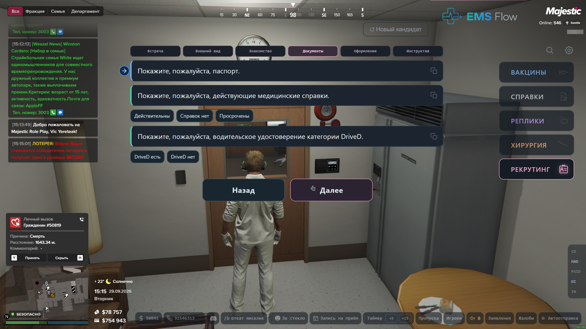
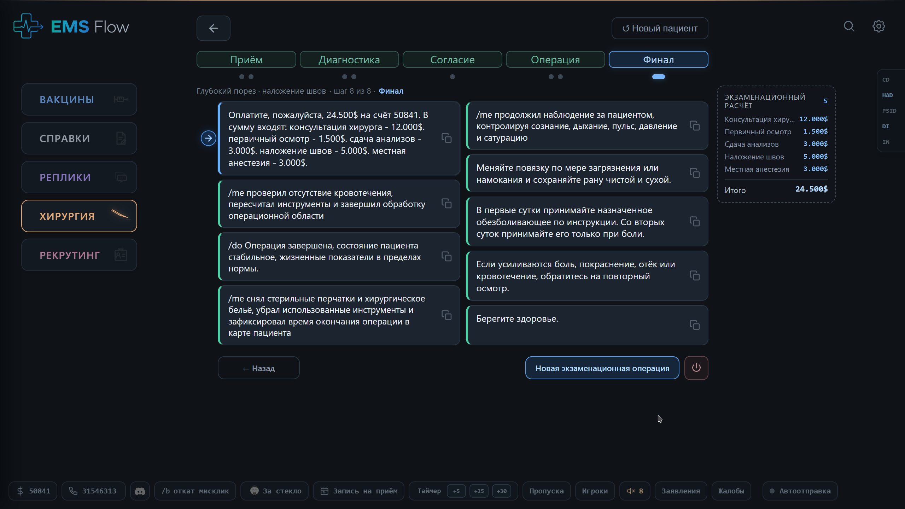
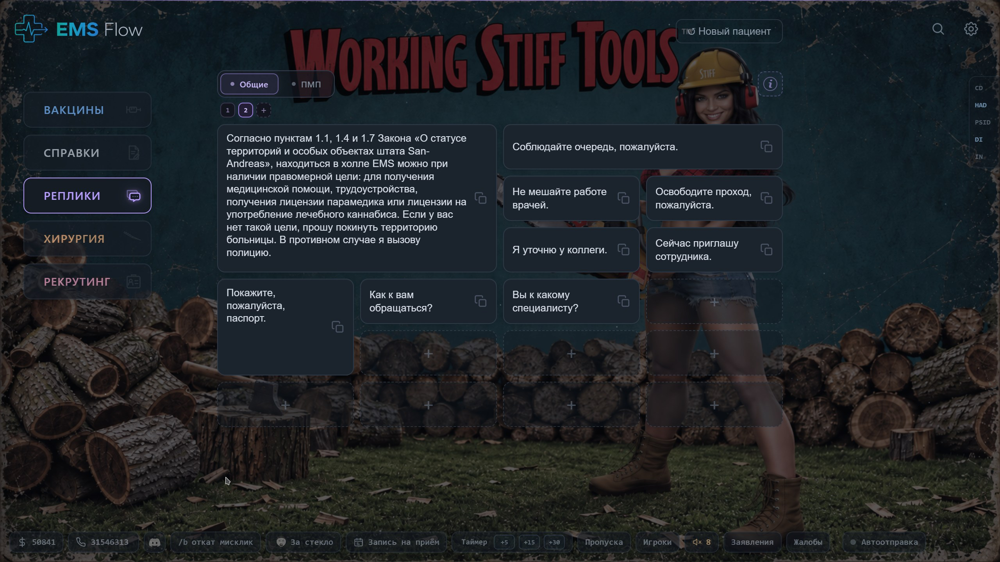
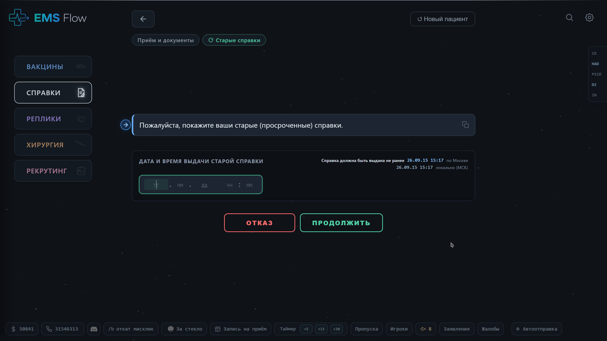
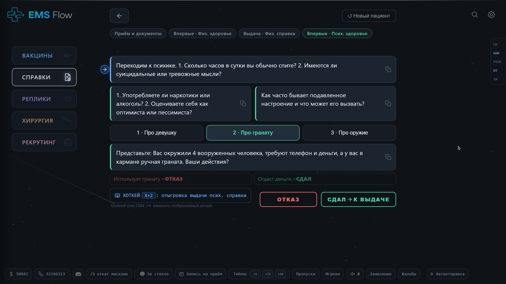
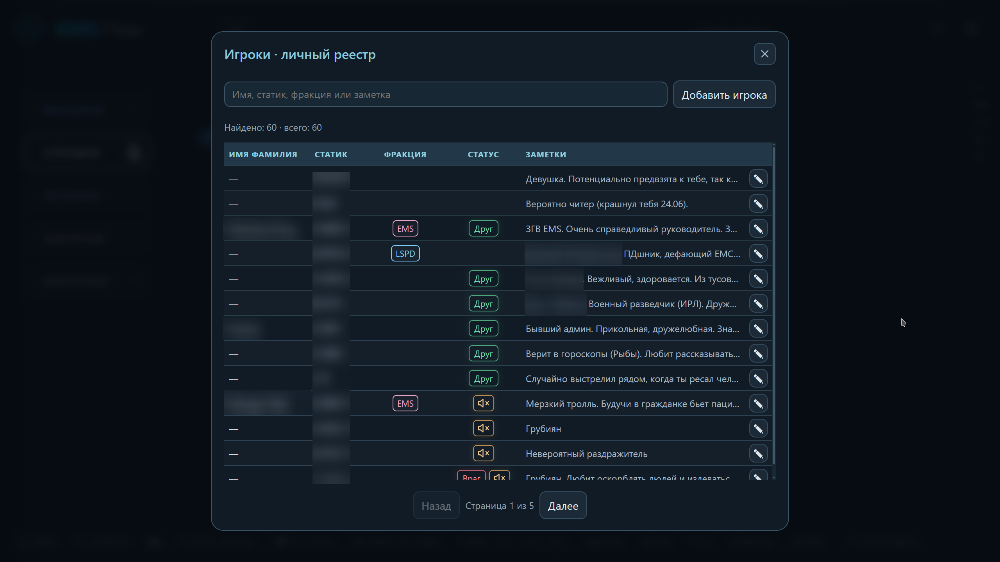
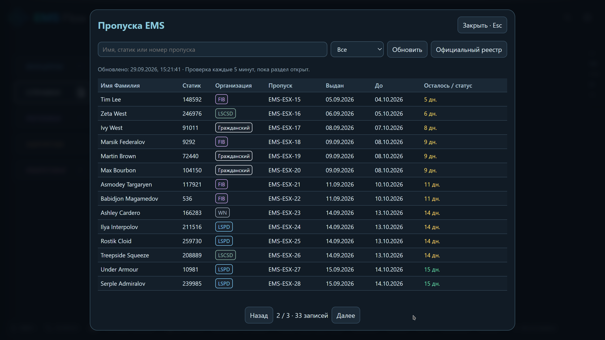
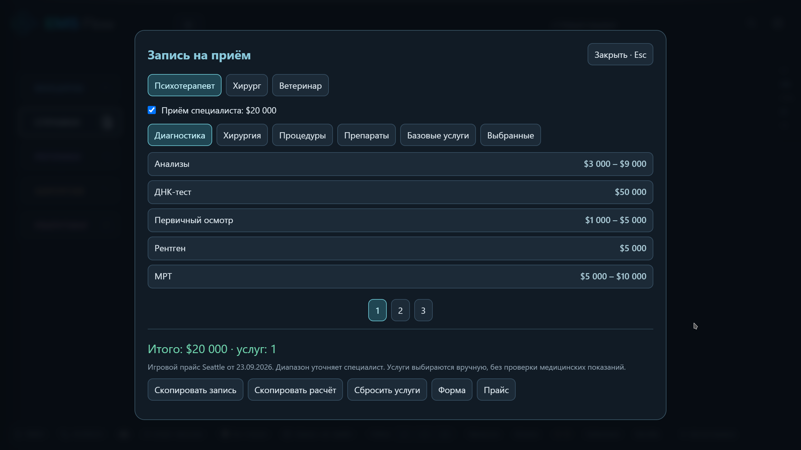
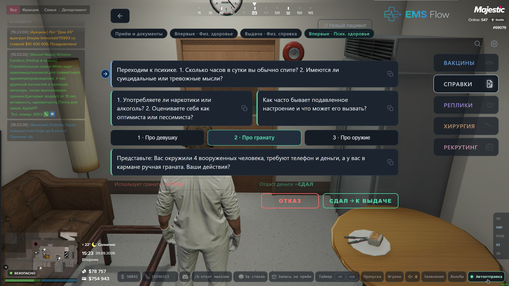

<p align="center">
  
</p>

<h1 align="center">EMS Flow</h1>

<p align="center">Настольный ассистент для сотрудников EMS сервера Seattle в Majestic RP.</p>
<p align="center"><strong>Ранняя альфа · Build 0248 · Windows x64 · Только Seattle</strong></p>

## Скачать

- [Установщик — Build 0248](https://github.com/VicDavis/EMS-Flow/releases/download/alpha-0248/EMS.Flow.Alpha.Setup.Build.0248.exe)
- [Портативная версия — Build 0248](https://github.com/VicDavis/EMS-Flow/releases/download/alpha-0248/EMS.Flow.Alpha.Portable.Build.0248.zip)
- [Релиз 0248: изменения, файлы и ограничения](https://github.com/VicDavis/EMS-Flow/releases/tag/alpha-0248)
- [Все выпуски](https://github.com/VicDavis/EMS-Flow/releases)

> Ранняя альфа: возможны ошибки. Оверлей, перетаскивание окна и автоотправку необходимо проверять внутри GTA на своей системе. Правила, цены и реплики рассчитаны на Seattle.

## Что нового в 0247–0248

- Центрирование после выхода из полного экрана и область перетаскивания окна, включая прозрачный режим.
- Единое компактное меню с цветными выдвижными ярлыками; исправлены цвета ярлыков в прозрачных настройках.
- «Фидбэк» с новой формой и компактным меню. Внешние ссылки открывают браузер по умолчанию, которому EMS Flow уступает передний план.
- Переключатель ДБ без расшифровки и дат; удалена постоянная плашка предпросмотра поиска.

[Подробности обновления 0248](docs/RELEASE_0248.md).

### Ранее, в 0245–0246

- Палитра реплик из 14 оттенков; Enter сохраняет редактирование, Escape отменяет изменения.
- Сердцебиение звучит только при запуске приложения.
- Упрощённый DB-рекрутинг, включительная дата пропуска и фильтр недействительных пропусков.
- Исправления выделения текста, зеркального меню настроек и высоты таблицы игроков.
- Ускорена автоотправка, включён «Откат мисклик», автоотправка включена по умолчанию с сохранением ручного выбора.

### Ранее, в 0241–0244

- Отметка «Мут» в личном реестре и последовательная отправка `/vmute статик` для отмеченных игроков.
- Исправления перетаскивания реплик: проекция полного размера, отмена Escape, перенос между страницами без случайного копирования.
- Новая компоновка оверлея: главное меню справа, компактный хотбар, меню отделов у правого края ниже основного меню, раскрытие при наведении.
- Памятки и подсказки временно скрываются в прозрачном режиме, не изменяя настройки обычного режима.
- Автоотправка использует прямой Unicode-ввод вместо Ctrl+V; добавлены паузы между этапами и корректная отмена.
- Убраны пустые плашки реестра, подпись автора перенесена на страницы без хотбара, обновлена встроенная документация.

[Полное описание изменений 0241–0246](docs/RELEASE_0246.md).

## Возможности

- Пошаговые маршруты вакцинации, справок, хирургии и рекрутинга Department of Internship.
- Готовые реплики, копирование отдельных предложений и сборка фразы из нескольких плиток.
- Собственные страницы реплик: редактирование, размеры плиток и перетаскивание.
- Личный реестр игроков: имя, статик, фракция, заметки, «Друг» / «Враг» и независимая отметка «Мут».
- Пропуска EMS, заявления, жалобы, запись на приём и быстрый таймер.
- Поиск по приложению, настройки интерфейса, звуков, фона и анимаций.
- Прозрачный оверлей, показ поверх игры и экспериментальная автоотправка в игровой чат.

EMS Flow — игровая шпаргалка и помощник по маршрутам, а не источник медицинских рекомендаций для реальной жизни.

## Установка и обновление

### Установщик

1. Закройте EMS Flow.
2. Скачайте `EMS.Flow.Alpha.Setup.Build.0248.exe`.
3. Установите поверх прежней версии в ту же папку приложения.
4. Сохранения удалять не нужно. Перед обновлением можно экспортировать настройки в приложении.

Не устанавливайте приложение в папку с исходным проектом. Выделите для него отдельный каталог.

### Портативная версия

1. Скачайте `EMS.Flow.Alpha.Portable.Build.0248.zip`.
2. Распакуйте и запустите EXE из архива.
3. При обновлении закройте приложение и замените portable-файл новой версией.

Обе редакции содержат необходимые компоненты. Установленная версия поддерживает обновления через GitHub; режим выбирается в настройках. Portable и HTML обновляются вручную.

Сборка не подписана сертификатом Authenticode: Windows SmartScreen может показать предупреждение о неизвестном издателе.

## Управление

| Действие | Управление |
| --- | --- |
| Показать EMS Flow поверх текущего окна / свернуть | Alt+D |
| Включить / выключить прозрачный оверлей | Alt+O |
| Переключить полный экран | F11; вне текстовых полей также F |
| Редактировать плитку реплики | Тройной ПКМ |
| Переместить плитку | Зажать ЛКМ и перетащить |
| Отменить перенос | Escape |
| Удалить текущую пустую страницу реплик | Delete вне редактора |
| Сохранить карточку игрока | Ctrl+Enter |
| Открыть документацию | Нажать логотип EMS Flow |

Alt+D не должен удалять значок с панели задач. В оверлее элементы EMS Flow принимают ЛКМ, свободное пространство предназначено для приложения под ним. Для GTA рекомендуется оконный или безрамочный полноэкранный режим.

## Автоотправка и массовый мут

1. Оставьте чат GTA закрытым.
2. Включите «Автоотправка» в хотбаре Windows-приложения.
3. Нажмите реплику: приложение передаст T → текст → Enter → ё.
4. Быстрые клики попадут в очередь. Не печатайте вручную, пока она выполняется.
5. При ошибке очередь останавливается без автоматических повторов. Если ввод работает неверно, выключите автоотправку и используйте ручное копирование.

В режиме автоотправки наборная фраза и таймлайн раздела «Реплики» отключены: отправляется каждая выбранная плитка отдельно. После запуска автоотправка выключена до явного включения.

Для массового мута укажите статик игрока, включите «Мут» в карточке и нажмите перечёркнутый динамик рядом с «Игроки». Команды отправляются последовательно. Повторное нажатие во время обработки останавливает оставшуюся очередь. Приложение не читает серверный результат: не повторяйте запуск без необходимости.

**Ограничения:** прямой ввод 0246 требует игровой приёмки, в том числе на системе тестера с пустым чатом. Проблемы выделения текста в desktop-редакторах и поведения Alt+Tab после Alt+D не объявляются окончательно исправленными.

## Как выглядит приложение

Скриншоты от 29 сентября 2026 года. Нажмите на изображение, чтобы открыть его в полном размере.

### Оверлей поверх GTA — рекрутинг

Прозрачный интерфейс и пошаговая проверка документов кандидата прямо поверх игры.

[](screenshots/0244/01-overlay-recruiting.jpg)

### Хирургия — маршрут и расчёт стоимости

Этапы операции, готовые RP-реплики и итоговый расчёт услуг в одном окне.

[](screenshots/0244/02-surgery.png)

### Реплики — собственная раскладка и фон

Плитки разных размеров, несколько страниц и свободные ячейки для своих фраз.

[](screenshots/0244/03-custom-replicas.jpg)

**Ещё 6 скриншотов — справки, личный реестр, пропуска, запись на приём и оверлей:**

<details>
<summary><strong>📷 Показать ещё 6 скриншотов — нажмите, чтобы раскрыть</strong></summary>

### Обновление справок

Ввод даты и времени выдачи старой справки перед продолжением маршрута.

[](screenshots/0244/04-certificate-renewal.png)

### Игровое собеседование для психической справки

Готовые вопросы, варианты ситуаций и переход к выдаче справки.

[](screenshots/0244/05-certificate-scenario.png)

### Личный реестр игроков

Поиск, фракции, заметки, статусы и независимая отметка «Мут». Имена и статики на снимке скрыты автором.

[](screenshots/0244/06-players-registry.png)

### Пропуска EMS

Поиск и фильтр реестра, цветные метки организаций и оставшийся срок действия.

[](screenshots/0244/07-passes.png)

### Запись на приём

Выбор специалиста и услуг, расчёт игровой стоимости и копирование подготовленной записи.

[](screenshots/0244/08-appointment.png)

### Справки в прозрачном режиме

Маршрут оформления справки поверх GTA; в хотбаре включён переключатель автоотправки.

[](screenshots/0244/09-overlay-certificates.jpg)

</details>

## SHA-256

```text
6b27cf286bb59583069717b230124cfeb32cb64230480d9aaf2d4e942d4c809f  EMS.Flow.Alpha.Setup.Build.0248.exe
a123c07998051d81ae031120bb2864ee7fc173a755bd38e9e1f6b52489f0b174  EMS.Flow.Alpha.Portable.Build.0248.zip
```

[Файл контрольных сумм](SHA256SUMS.txt). Обычная установка не требует ручной проверки.

Архивы GitHub `Source code (zip/tar.gz)` не являются приложением. Исходный код EMS Flow не публикуется: репозиторий содержит документацию и готовые сборки.

## Данные и приватность

Настройки и личный реестр хранятся в профиле пользователя Windows: `%APPDATA%\ems-flow-desktop`. Экспорт может содержать личные заметки — не передавайте его посторонним.

Удаление этой папки сбрасывает настройки и локальные данные; для обычного обновления это не требуется. Проверка обновлений обращается к GitHub и управляется в настройках. Автоотправка и массовый мут передают выбранный текст/команды в игру по действию пользователя.

## История и обратная связь

- [Журнал изменений](CHANGELOG.md)
- [История разработки](docs/DEVELOPMENT_HISTORY.md)
- [Архив ранних версий](docs/HISTORY_V058_TO_V072.md)
- [Дорожная карта](ROADMAP.md)
- [Telegram-сообщество EMS Flow](https://t.me/+qNzY6aaGcqlmMDdi)

Сообщая об ошибке, укажите сборку, режим окна, включена ли прозрачность/автоотправка, и последовательность действий. Не прикладывайте личные заметки или полный экспорт без проверки содержимого.

## Поддержать разработчика

[Купить разработчику чашку чая](https://www.donationalerts.com/r/vicstiglitz)

## Автор

разработчик [VicDavis](https://github.com/VicDavis).

© 2026 Vixpress. Все права защищены. Распространяется готовая альфа-сборка; разрешение на публикацию, изменение или распространение исходного кода не предоставляется.
